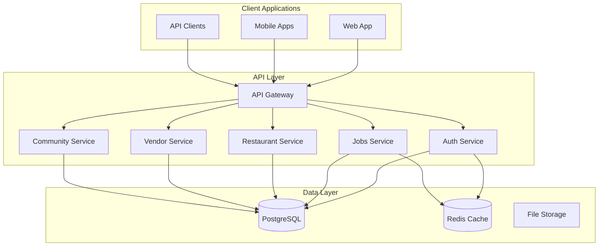

# RestoPapa Documentation

Welcome to the comprehensive documentation for the RestoPapa platform - a complete B2B/B2C SaaS solution for the restaurant industry.

## 📋 Documentation Overview

This documentation covers all aspects of the RestoPapa platform, from API integration to user guides and system architecture. Whether you're a developer, restaurant owner, employee, vendor, or administrator, you'll find the resources you need here.

## 🚀 Quick Start

### For Developers
- **[API Documentation](./api/README.md)** - Complete API reference with examples
- **[OpenAPI Specification](./api/openapi-specification.yaml)** - Interactive API documentation
- **[Developer Integration Guide](./integration/developer-guide.md)** - SDKs, code samples, and best practices
- **[Authentication Guide](./security/authentication-guide.md)** - Security implementation details

### For Restaurant Owners
- **[Getting Started Guide](./user-guides/restaurant-owners/getting-started.md)** - Set up your restaurant and start hiring
- **[Job Management](./user-guides/restaurant-owners/job-management.md)** - Post jobs and manage applications
- **[Employee Management](./user-guides/restaurant-owners/employee-management.md)** - Team management tools

### For Employees
- **[Employee Guide](./user-guides/employees/getting-started.md)** - Find and apply for restaurant jobs
- **[Profile Management](./user-guides/employees/profile-management.md)** - Build your professional profile
- **[Job Search Tips](./user-guides/employees/job-search.md)** - Maximize your job search success

### For Vendors
- **[Vendor Onboarding](./user-guides/vendors/getting-started.md)** - Start selling to restaurants
- **[Product Management](./user-guides/vendors/product-management.md)** - Manage your product catalog
- **[Order Processing](./user-guides/vendors/order-processing.md)** - Handle restaurant orders

### For Administrators
- **[Admin Panel Guide](./user-guides/administrators/admin-panel.md)** - Platform administration
- **[User Management](./user-guides/administrators/user-management.md)** - Manage platform users
- **[System Monitoring](./user-guides/administrators/system-monitoring.md)** - Monitor platform health

## 📖 Complete Documentation Index

### API Documentation
| Document | Description | Audience |
|----------|-------------|----------|
| [API Overview](./api/README.md) | Complete API documentation with examples | Developers |
| [OpenAPI Specification](./api/openapi-specification.yaml) | Machine-readable API specification | Developers, Tools |
| [Authentication Guide](./security/authentication-guide.md) | JWT tokens, security, and RBAC | Developers |

### Integration Guides
| Document | Description | Audience |
|----------|-------------|----------|
| [Developer Guide](./integration/developer-guide.md) | SDKs, code samples, webhooks | Developers |
| [Mobile Integration](./integration/mobile-guide.md) | React Native and Flutter examples | Mobile Developers |
| [Web Integration](./integration/web-guide.md) | React, Vue, Angular examples | Frontend Developers |

### Architecture Documentation
| Document | Description | Audience |
|----------|-------------|----------|
| [System Overview](./architecture/system-overview.md) | Complete architecture documentation | Developers, DevOps |
| [Database Schema](./database/schema-documentation.md) | Database design and relationships | Developers, DBAs |
| [Security Architecture](./security/security-overview.md) | Security design and implementation | Security Engineers |

### User Guides
| Document | Description | Audience |
|----------|-------------|----------|
| [User Guide Overview](./user-guides/README.md) | Platform overview for all users | All Users |
| [Restaurant Owners](./user-guides/restaurant-owners/) | Complete restaurant management guide | Restaurant Owners |
| [Employees](./user-guides/employees/) | Job search and career development | Job Seekers |
| [Vendors](./user-guides/vendors/) | B2B marketplace and selling | Suppliers |
| [Administrators](./user-guides/administrators/) | Platform administration | Admins |

### Deployment & Operations
| Document | Description | Audience |
|----------|-------------|----------|
| [Deployment Guide](./deployment/deployment-guide.md) | Production deployment instructions | DevOps |
| [Monitoring Setup](./operations/monitoring-guide.md) | System monitoring and alerting | DevOps |
| [Backup & Recovery](./operations/backup-recovery.md) | Data backup and disaster recovery | DBAs, DevOps |

## 🏗️ Platform Architecture

### System Components



### Technology Stack

#### Backend
- **Framework**: NestJS with TypeScript
- **Database**: PostgreSQL with Prisma ORM
- **Cache**: Redis for sessions and caching
- **Authentication**: JWT with role-based access control
- **File Storage**: Cloudinary for images and documents

#### Frontend
- **Web**: Next.js with React and TypeScript
- **Mobile**: React Native with Expo
- **Styling**: Tailwind CSS
- **State Management**: React Query for server state

#### Infrastructure
- **Containerization**: Docker and Docker Compose
- **Orchestration**: Kubernetes (production)
- **CI/CD**: GitHub Actions
- **Monitoring**: Prometheus and Grafana
- **Logging**: Winston with structured logging

## 🔐 Security Features

### Authentication & Authorization
- **Multi-role system**: Admin, Restaurant, Employee, Vendor, Customer
- **JWT-based authentication** with refresh token rotation
- **Two-factor authentication** (TOTP-based)
- **Role-based access control** (RBAC)
- **Account verification** with document upload
- **Email verification** on signup
- **Password reset** with secure tokens

### Data Protection
- **Encryption**: AES-256 for sensitive data
- **HTTPS**: All communications encrypted in transit
- **GDPR compliance**: Data export and deletion
- **Audit logging**: Complete activity tracking
- **Rate limiting**: Protection against abuse

### Security Monitoring
- **Brute force protection**: Account lockout mechanisms
- **Suspicious activity detection**: Automated monitoring
- **Security headers**: Helmet.js implementation
- **Input validation**: Comprehensive sanitization

## 📊 Key Features

### POS & Kitchen Display System
- **Real-time KDS** via WebSocket for kitchen communication
- **Order management** (dine-in, takeaway, delivery)
- **POS payments** (cash, card, UPI, wallet)
- **Customer loyalty** programs with points

### Inventory Management
- **Batch tracking** with expiry dates
- **Stock movements** (in/out)
- **Reorder requests** (auto/manual triggers)
- **Low stock alerts** via webhooks

### Menu Management
- **Categories, items, modifiers, variants**
- **Allergen and tag support**
- **Real-time menu updates**

### Staff & Reservations
- **Employee management** with designations
- **Shift scheduling** and attendance
- **Leave management**
- **Table management** with QR codes
- **Table reservations**

### Financial
- **Stripe + Razorpay** payments
- **Invoice generation**
- **Refund processing**
- **Double-entry bookkeeping**
- **Expense tracking**
- **Tax calculations**

### Job Management System
- **Job postings** with rich descriptions
- **Application tracking** with status management
- **Verification requirements** for sensitive operations

### B2B Marketplace
- **Vendor catalog management** with product listings
- **Order processing** with automated workflows
- **Supplier relationship management**

### Community Platform
- **Discussion forums** with @vendor #product mentions
- **Restaurant reviews** and ratings
- **Role-based visibility** controls

### Integrations
- **ReZ SSO Bridge** - Single sign-on via ReZ platform
- **NextaBizz Sync** - Bidirectional inventory sync
- **Webhook system** for external events

## 📈 Platform Capabilities

### Database Models
- **90+ Prisma models** covering all business domains
- Restaurant, Branch, Employee, User
- Order, PosOrder, Customer, MenuItem
- InventoryBatch, StockMovement, Product
- Invoice, Payment, Refund, JournalEntry
- CommunityPost, Review, Job, TableReservation

### API Features
- RESTful API with OpenAPI/Swagger documentation
- WebSocket endpoints for real-time KDS
- JWT authentication with refresh tokens
- Role-based access control (RBAC)
- Rate limiting and request validation
- Webhook support for external integrations
- ReZ SSO Bridge integration
- NextaBizz inventory sync

## 🛠️ Development & Contribution

### Development Setup
```bash
# Clone the repository
git clone https://github.com/restopapa/platform.git
cd platform

# Install dependencies
npm install

# Set up environment
cp .env.example .env
# Edit .env with your configurations

# Set up database
npm run db:migrate
npm run db:seed

# Start development server
npm run dev
```

### API Testing
```bash
# Run unit tests
npm run test

# Run integration tests
npm run test:e2e

# Test API endpoints
npm run test:api

# Performance testing
npm run test:perf
```

### Contributing Guidelines
1. **Fork the repository** and create a feature branch
2. **Follow coding standards** and write tests
3. **Update documentation** for new features
4. **Submit pull request** with detailed description
5. **Code review process** and approval

## 📞 Support & Contact

### Getting Help
- **Documentation**: Comprehensive guides and references
- **API Reference**: Interactive API documentation
- **Community Forums**: Peer-to-peer help and discussions
- **Support Tickets**: Direct support for complex issues

### Contact Information
- **General Support**: support@restopapa.com
- **Developer Support**: dev-support@restopapa.com
- **Business Inquiries**: business@restopapa.com
- **Security Issues**: security@restopapa.com

### Response Times
- **Critical Issues**: 2-4 hours
- **General Support**: 24-48 hours
- **Feature Requests**: 1-2 weeks
- **Documentation Updates**: 1 week

### Community
- **GitHub**: [github.com/restopapa](https://github.com/restopapa)
- **LinkedIn**: [@RestoPapa](https://linkedin.com/company/restopapa)
- **Twitter**: [@RestoPapa](https://twitter.com/restopapa)
- **Discord**: [RestoPapa Community](https://discord.gg/restopapa)

## 📅 Version History

For complete changelog, see [CHANGELOG.md](../CHANGELOG.md) in the root directory.

### Recent Updates (April-May 2026)
- **Security Audit**: Full monorepo security review (~45 issues fixed)
- **Password Reset**: Full implementation with secure tokens
- **Email Verification**: Auto-sent on signup with TOTP-based 2FA
- **ReZ SSO Bridge**: Single sign-on integration with ReZ platform
- **NextaBizz Integration**: Bidirectional inventory sync
- **Community Mentions**: @vendor #product $service tagging

## 📄 License

This project is licensed under the MIT License.

---

**Last Updated**: May 2026
**Documentation Version**: v1.1.0
**Platform Version**: v1.1.0